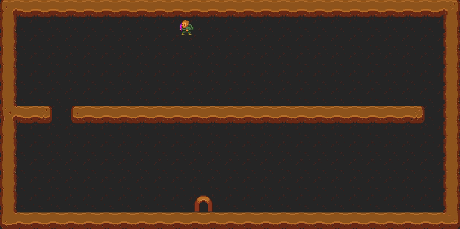

# Prácticas TSI
*Contiene todas la prácticas realizadas en la asignatura TSI en la UGR durante el curso 20/21*

## Práctica 1: Técnicas de Búsqueda Heurística

Para esta práctica se ha hecho uso del entorno GVGAI para la creación de un agente que resuelve niveles del juego Boulder Dash, pero modificando ciertas reglas del juego original.

Las diferencias respecto al juego original son las siguientes:

- Todos los enemigos están liberados desde el comienzo.
- No hay rocas que puedan caer sobre el avatar.

El agente debe tener los siguientes comportamientos:

- **Comportamiento deliberativo simple**: búsqueda del camino óptimo al portal (sin enemigos, pero con la posible presencia de obstáculos).
- **Comportamiento deliberativo compuesto**: búsqueda de 9 gemas (en un mapa con un número superior o igual de gemas) y salida por el portal.
- **Comportamiento reactivo simple**: mantenerse alejado de un enemigo durante un tiempo predeterminado (2000 ticks).
- **Comportamiento reactivo compuesto**: mantenerse alejado de dos enemigos durante un tiempo predeterminado (2000 ticks).
- **Comportamiento reactivo-deliberativo**: búsqueda de 9 gemas (en un mapa con un número superior o igual de gemas), evitando el enemigo presente en el mapa y, una vez se tengan todas, alcanzar el portal dentro de los límites de tiempo predeterminados (2000 ticks).

### Comportamiento deliberativo simple

Para el cálculo del camino hacia una gema se hace uso del algoritmo A*.

| Visualización del nivel |
| :---: |
|  |

### Comportamiento deliberativo compuesto

Para implementarlo de hace uso del deliberativo simple añadiendo la elección de la gema a la que dirigirse en cada momento.

Para elegir la gema se hace uso del algoritmo greedy, usando como heurística la distancia Manhattan.

### Comportamiento reactivo

Para conseguir evitar a los enemigos se hace uso de un mapa de calor.

En este mapa de calor deprenden calor tanto los enemigos como los muros, teniendo cada uno un radio de calor distinto.

Al inicio del nivel se desprende el calor de los muros. Y en cada movimiento se calcula el calor de cada enemigo. Para calcular el calor de los enemigos se hace uso de un mecanismo recursivo para simular una expansión del calor realista, es decir, que si hay un muro el calor no lo atraviese sino que lo rodee.

Cuanto más cerca del muro como del enemigo más calor se desprende. Por cada casilla que se aleja del centro se disminuye en una unidad el calor.

### Comportamiento reactivo-deliberativo

Para este comportamiento se combinan los comportamiento deliberativos y reactivos compuestos, con pequeñas modificaciones para unir ambos comportamientos.

